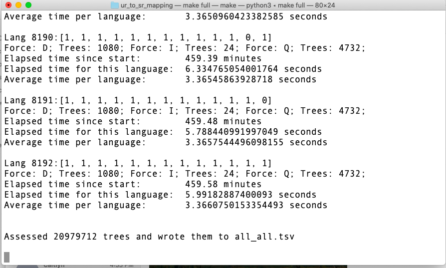

# UR to SR mapping over 13 parameters
This project creates mappings of every licit combination of (meaninglessly ordered) underlying lexical items (n=8) to a resultant Surface Order of Words (SOWs/SRs/"a sentence").  Each "sentence" mapping is produced by feeding a UR into a static syntactic tree and then applying the rules of a particular parameter set (features of a "language family").  In the syntactic tree each lexical item has a fixed birthplace, prescribed movement loci, and is unerlyingly null until it is turned on (through presence in the UR or a setting being on or off, etc.).

This project is intended to be used by an Expectation Maximization learning algorithm (Expectation Driven Learning (EDL)) as input data.  Working through each UR-to-SR mapping in a language family's data, the algorithm updates its beliefs about what language is being viewed.  This algorithm is essentially a proxy for human language learning under the principles and parameters model, in which the marginal addition of language data from each utterance updates a learner's assumptions about the language family they are learning, and the grammatical attributes of their language family.

Thus, this project represents an abstracted sample of language data that a human learner would encounter while learning a language, with the UR representing something like the semantically meaningful items and the SR/SOW representing the heard or produced utterance.

The parameters of the current project are based on the 13 outlined in a [Sakas & Fodor 2012 article](http://www.colag.cs.hunter.cuny.edu/pub/Sakas_Fodor_Disambiguating_prepub.pdf#24).  We wanted to plumb the structure of their parametric grammar, and produce a mapping that would be more appropriate for feeding to the EDL algorithm.

The language family set created by the 13 parameters and resulting in 8192 "language families" are extendable/scalable by adding additional parameters in [src/parameters.py](https://github.com/rofgh/ur_to_sr_mapping/blob/04ee506608f7c58b81418987d333ec76d639e712/src/parameters.py#L1).  Depending on the format of this parameter, this will require the addition of syntactic tree lexical item(s), which would need to be reflected in [nodes.py](https://github.com/rofgh/ur_to_sr_mapping/blob/04ee506608f7c58b81418987d333ec76d639e712/src/nodes.py#L1) and changes to the [UR_writer](https://github.com/rofgh/Hidden-Sin/tree/master/UR_writer).  Essentially, scaling by another parameter requires some fluency in the script, but is reasonably possible.

See the [src readme](https://github.com/rofgh/ur_to_sr_mapping/blob/master/src/README.md) for more in depth descriptions of the code.

Our preliminary thoughts/description/notes/analysis/interpretation of the original SFY grammar and languages can be found [here](https://docs.google.com/document/d/1J_fS85IQWB9MPXB96ccHrKF_JHXn44iVyyemQOeFJQo/edit?usp=sharing)

## parent.py
Run this on the command line (python3)  (or 'make run' if make is installed, see [makefile](https://github.com/rofgh/ur_to_sr_mapping/blob/04ee506608f7c58b81418987d333ec76d639e712/Makefile#L1))  
This file takes four arguments, default=False/None in order to run a smaller domain, and begins the ur_to_sr_mapping code set.  

Make full, which will run all 8192 language families (2GB tsv file at the moment (5/24/20)) (~8 hour run time)
```
$ python parent.py True True True all_all.tsv
OR
$ make full
```
Make run, which will run just the small subset of language families:
```
$ python3 parent.py False False False run.tsv
OR
$ make run

```
1  
The first boolean argument determines whether all languages families are run (True) (n=8192) or whether only the [limited user-modified list](https://github.com/rofgh/ur_to_sr_mapping/blob/1ab96bdabc231e07334c53806e0bcb91129e5752/src/various.py#L4) is assessed (False) (e.g. [0,0,0,1,0,0,1,1,0,0,0,1,1]).

2  
The second argument determines whether all forces are assessed (True) or whether just one or two of the three are used (False) (Currently set to "D"eclarative in the [various.py scripts](https://github.com/rofgh/ur_to_sr_mapping/blob/1ab96bdabc231e07334c53806e0bcb91129e5752/src/various.py#L62))

3  
Limits the set of URs to assess (see [various.py def activate_force()](https://github.com/rofgh/ur_to_sr_mapping/blob/efaf037f7c93b0af515be8cef8e0796705f152d4/src/various.py#L6)).  If a file is given, the script will run on a limited set of URs, which reduces the run time of the program, especially if all languages are being assessed.  Otherwise, this argument is False and all UR permutations are produced and mapped.  
An example of a test UR list is in test.URs.txt: "S Verb" + "S  Verb    Aux"

4  
Argument 4 is an output filename different from the default all_all.tsv  The DEFAULT filename should only be used for the running of all parameter settings, all forces, and all URs.  Otherwise the script will overwrite the all languages file if it has already been made (and thus overwrite 8 hours of work).

This script also times how long each language family takes to produce, as well as the whole operation.

## Results Examples
The last time the code was fully run it took 7.66 hours.  This speed could be improved greatly by changing how the data is saved.  Since the data file starts out at 0MB and by the end of the run it is 2GB, it starts being taxing to open the file in order to write to it.  

A sample from all_all.tsv looks like:
```bash
0000000000100	D	S	Verb	        SR:	Not parseable because of Parameter: 4: no topic and topic is obligatory			
0000000000100	D	S	Verb	Aux		SR:	Not parseable because of Parameter: 4: no topic and topic is obligatory			
0000000000100	D	S	Verb	Adv		SR:	Not parseable because of Parameter: 4: no topic and topic is obligatory			
0000000000100	D	S	Verb	O1		SR:	Not parseable because of Parameter: 4: no topic and topic is obligatory
0001001100011	D	S	Verb			SR:	S	Verb
0001001100011	D	S	Verb	Aux		SR:	S	Aux	Verb
0001001100011	D	S	Verb	Adv	    SR:	S	Verb	Adv
0001001100011	D	S	Verb	O1		SR:	S	Verb	O1
0001001100011	D	S	Verb	PP		SR:	S	Verb	P	O3
0001001100011	D	S	Verb	Aux	Adv	SR:	S	Aux	Verb	Adv
0001001100011	D	S	Verb	Aux	O1	SR:	S	Aux	Verb	O1
0001001100011	D	S	Verb	Aux	PP	SR:	S	Aux	Verb	P	O3	
```
For this example language family (0000000000100), none of these sentences are parseable.  If the UR were parseable, the licit SR(s) would be provided.

With this structure, a learning algorithm could easily pull the UR-SR mappings from the all_all.tsv file by separating the language, force, ur and sr on each line.

### Github Folders:  
[src](https://github.com/rofgh/Hidden-Sin/tree/master/src): these are the modules accessed by parent.py and sr_creator.py.  Also contains [UR_writer](https://github.com/rofgh/Hidden-Sin/tree/master/src/UR_writer):  Scripts that create the URs

[grabber](https://github.com/rofgh/Hidden-Sin/tree/master/grabber): this script pulls the SRs (and, optionally, the URs) form the original CoLAG data.  It is used for confirming correct production of this project.  

[S_F_Y_Data_Files](https://github.com/rofgh/Hidden-Sin/tree/master/S_F_Y_Data_Files): Self-explanatory  

[Misc](https://github.com/rofgh/Hidden-Sin/tree/master/Misc): Items that got put into the Notes shared doc, etc.  

[EDL Learner](https://github.com/rofgh/Hidden-Sin/tree/master/EDL%20Learner): Original 6 parameter script, etc.  

[Reference Papers](https://github.com/rofgh/Hidden-Sin/tree/master/Reference%20Papers):   
 


